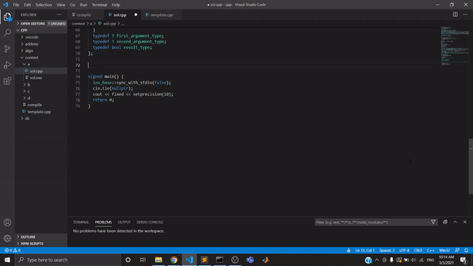
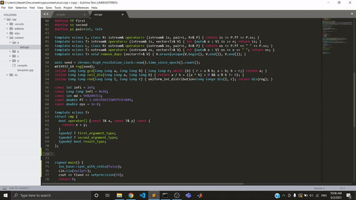

## VSCode & Sublime-Text Snippets - Getting the most out of the repository
* __VS Code__: Copy `cpp.json` file to `C:\Users\{username}\AppData\Roaming\Code\User\snippets\cpp.json` to use the codes using VSCode snippets utility.

* __Sublime-Text__: Copy the files inside `sublime-snippet` to `C:\Users\{username}\AppData\Roaming\Sublime Text 3\Packages\User` to enable tab triggers in Sublime-Text.

## Prefix / Tab triggers to be used

### Number Theory
* __modular__: Handling modular integers
* __matrix__: Matrix with binary exponentiation utility
* __phi__: Euler totient function (for given integer only)
* __phi_1_to_n__: Computing totient function for `1, 2, ..., n`
* __spf__: Sieve of smallest prime factors
* __primes__: Getting all the primes number within given upper bound

### Data structures
* __dsu__: Disjoint union-find data structure
* __pbds__: Priority-based data structures
* __fenwick__: Fenwick tree for prefix sums
* __rmq__: Sparse table
* #### Segment Tree
  * __seg__: Segment tree (without lazy propagation)
  * __lazy__: Segment tree (with lazy propagation)
* #### Sqrt Decomposition
  * __mo1__: Query structure for Mo's algorithm
  * __mo2__: For updating range to current query
  
### String Algorithms
* __z_function__: Computing Z-values
* __prefix_function__: Computing prefix function
* __string_hash__: Rabin-karp hashing
* #### Trie
  * __trie__: Trie of strings
  * __trie_int__: Trie of bits

### Graph Theory
* __centroid__: Centroid of each subtree in a tree
* __diameter__: Diameter of a tree
* __scc__: Kosaraju' algorithm for strongly connected components
* __digraph__: Directed graphs with edges over a range (See [this](https://codeforces.com/contest/786/problem/B))
* #### LCA
  * __lca__: Computing lca using rmq
  * __lca_binarylift__: Computing lca using binary lift
  * __lca_seg__: Computing lca using segment tree
* #### Heavy-light decomposition
  * __hld_point__: HLD decomposition considering _point_ updates
  * __hld_range__: HLD decomposition considering _range_ updates
  
### Geometry
* __point__: 2d points
* __line_int__: 2d straight lines
* __line_double__: 2d straight lines
* __dynamic_hull__: Finding optimal `ax + b` for given `x` using _convex hull trick_

### Debugging
* __debug__: Debugging utility (except `__int128` integers and static arrays)
* __pr__: Debugging utility for `__int128` integers and static arrays

## Other References for Competitive Programming
* [Benq Codes](https://github.com/bqi343/USACO)
* [KTH Resources](https://github.com/kth-competitive-programming/kactl)
